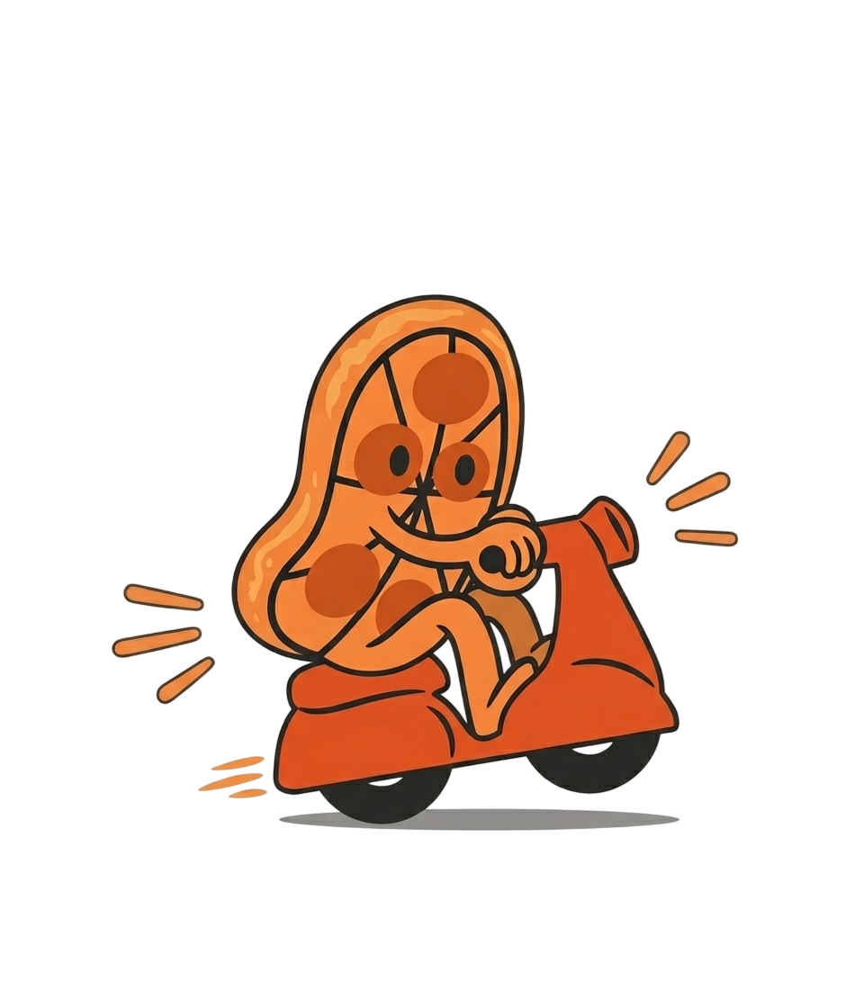

<div align="center">
  

  <h1>Chito Mitho</h1>

  <p>
    A connected food delivery system for Kathmandu, built for customers,
    restaurants, riders, and owner-side management.
  </p>

  <p>
    
    
    
    
  </p>
</div>

<div align="center">
  
</div>

## Overview

Chito Mitho is a Kathmandu-focused food delivery app that connects browsing, ordering, restaurant queues, rider pickup, and owner-side control in one Supabase-backed system. It is built for a complete local delivery workflow, from the landing page to checkout, delivery tracking, and restaurant approval.

## Features

<p>
  
  
  
  
  
  
</p>

Customers discover food, restaurants manage orders, riders handle pickups, and the project owner manages approvals and platform activity.

## Preview

<div align="center">
  
</div>

## Project Structure

```text
Food-Delivery-App/
+-- apps/
|   +-- web/              # Vite React landing page, customer app, dashboards
|   +-- mobile/           # Expo React Native customer and rider app
+-- packages/
|   +-- api/              # Supabase queries, auth helpers, eSewa helpers
|   +-- ui/               # Shared UI components and brand assets
|   +-- utils/            # Shared business logic and constants
|   +-- config/           # Shared Tailwind config
+-- supabase/
|   +-- migrations/       # Database setup and seed data
+-- scripts/              # Brand asset sync and project scripts
```

## Getting Started

```bash
npm install
cp .env.example .env
./run.sh
```

Run a specific target:

```bash
./run.sh web
./run.sh mobile
./run.sh both
```

Add Supabase, Google Maps, and optional Groq keys in `.env`.

## Run Options

```bash
./run.sh both phone      # Web + Android phone
./run.sh both emulator   # Web + Android emulator
./run.sh mobile expo     # Expo dev server only
```

<details>
  <summary>Workspace maintenance scripts</summary>

```bash
npm run build
npm run lint
npm run brand:sync
```

</details>

## Environment Variables

```bash
VITE_SUPABASE_URL=
VITE_SUPABASE_ANON_KEY=
VITE_GOOGLE_MAPS_API_KEY=
VITE_GROQ_API_KEY=

EXPO_PUBLIC_SUPABASE_URL=
EXPO_PUBLIC_SUPABASE_ANON_KEY=
EXPO_PUBLIC_GOOGLE_MAPS_API_KEY=
EXPO_PUBLIC_ENABLE_NATIVE_GOOGLE_MAPS=true
```

## Database

Supabase migrations live in `supabase/migrations`. Point web and mobile at the same Supabase project so orders, riders, restaurants, and admin tools share one data source.

## Brand

<p>
  
  
  
  
  
</p>

Assets: `logo.png`, `hero-illustration.png`, and `app-screenshot.jpg` in `packages/ui/assets`.

## License

This project is private. Add a license before distributing it publicly.
